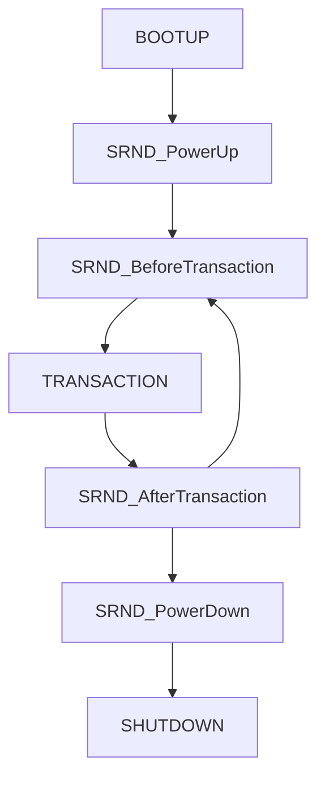

# SRND - Software Based Random Number Generation Layer for Secure Payment Systems
EMV-co approved Terminal Unpredictable Number algorithm

This stack is designed for L2 EMV Kernels to generate EMV-co approved Terminal Unpredictable Number internally.

## The algorithm has written according to :
Specification Bulletin No. 144
First Edition June 2014
Terminal Unpredictable Number generation
SB144_Terminal_Unpredictable_Number_generation_20140624110321447.pdf

## The Specification Bulletin applies to:
- EMV Integrated Circuit Card Specifications for Payment Systems Version 4.3 Book 2 Security
and Key Management
- EMV Integrated Circuit Card Specifications for Payment Systems Version 4.3 Book 4
Cardholder, Attendant, and Acquirer Interface Requirements

## Description
This bulletin introduces a specific approved method into Book 2 for generating Terminal
Unpredictable Numbers (UNs). This bulletin also clarifies that it is permitted that a terminal use the
same UN throughout a transaction.

## Background
The Terminal Unpredictable Number (tag 9F37) is sent to the card during an EMV transaction and is
included by the card in the data protected by the card cryptogram (whether it be a DDA/CDA
signature or an Application Cryptogram). The purpose of the UN is to ensure that card cryptograms
are freshly produced and not replays of cryptograms previously obtained from the card. It is for this
reason that the UNs generated by a terminal must be unpredictable. It should be infeasible for an
attacker to guess or control the values of the UNs that the terminal generates (for them each possible
32-bit value should be equally likely even given knowledge of previous UN values).
The EMV Acquirer and Terminal Security Guidelines includes guidance and best practice for UN
generation and a schema for generating UNs. The purpose of the current bulletin is to go beyond this
schema and introduce a specific algorithm for an EMV kernel to generate UNs. This algorithm may
be considered as a whitening or washing process to be applied to a random number produced outside
the kernel (e.g. a PCI approved hardware RNG). However this method is also considered suitable for generating UNs in the absence of such an external random number source (e.g. in case the hardware
RNG fails partially or completely).

## Parameters
### TID
Terminal ID
EMV Data element tag '9F1C'
8 bytes alpha numeric (see Table 33 of EMV Book 3)

### IFDSN
IFD Serial
EMV Data element tag '9F1E'
8 bytes alpha numeric (see Table 33 of EMV Book 3)

### TVP
Time varying parameter
Date and time with finer granularity than 0.1 second
Implementation dependent. Should be an internal value not the external clock

### RAND
Value from external RNG
Random value sourced outside the kernel (e.g. PCI-approved hardware RNG) to be used if available
8 bytes binary

### P
Pre-image of UN
P is an internal register maintained in the terminal in volatile memory and never output.
32 bytes binary

### Q
Persistent variant of P
Q shall be initialised to a terminal-unique random number prior to deployment. It is maintained in the terminal in non-volatile memory and never output. It is updated every time the power is cycled.
32 bytes binary

### AC
Application Cryptogram
This is generated by card and can be read by GENERATE AC (9F26) command
8 bytes binary

## SHA-256 Background
Implementation of the SHA-256 hashing algorithm specification can be found here:
http://csrc.nist.gov/publications/fips/fips180-2/fips180-2withchangenotice.pdf
This implementation uses little endian byte order.

## The stack needs;
- Some device specific parameters such as IFD Serial Number, Terminal ID
- Time varying parameter, a random number and application cryptogram - if available
- File system (write/read) functions
externally

## Build and run
```
make clean
make
./srnd_test
```

## Work flow


## Usage example
```
SRND_PowerUp(TID, IFDSN, TVP, RAND);

SRND_BeforeTransaction(RAND, UN);
doTransaction(UN, AC); // 1
SRND_AfterTransaction(TVP, RAND, AC);

SRND_BeforeTransaction(RAND, UN);
doTransaction(UN, AC); // 2
SRND_AfterTransaction(TVP, RAND, AC);

SRND_PowerDown();
```

## Test log
```
SRND test 1
        UN : BF1A79F1
        UN : 29E3C1EF
        UN : 18D653EB
        UN : E0CE45CB
SRND test 1 has 4 transactions
SRND test 2
        UN : 41C00129
        UN : 6882F1FA
        UN : 1BCE2591
        UN : A010AC07
        UN : 72344252
        UN : 053151C0
        UN : DEF5F04A
        UN : 755611AB
        UN : 1DC79004
        UN : E010820E
SRND test 2 has 10 transactions
SRND test 3
        UN : 4AD9E0B7
        UN : 8674AEA6
        UN : 67D7DCBA
SRND test 3 has 3 transactions
SRND test 4
        UN : C0452D30
        UN : 5C2D4118
        UN : 0C401BBD
        UN : 339E70FA
        UN : A01E8963
        UN : A68FDE1F
        UN : FF680403
        UN : EF786FDA
SRND test 4 has 8 transactions
```
